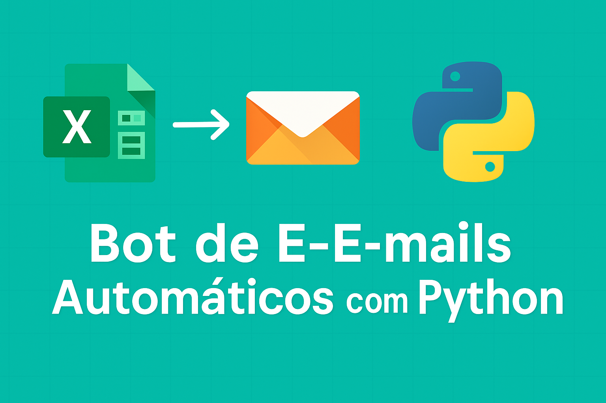

# 📬 Bot de E-mails Automáticos com Python

Automatize o envio de e-mails personalizados com Python e planilhas Excel. Ideal para cobranças, notificações e lembretes de forma automatizada.

## Funcionalidades

- Leitura de planilha com dados dos clientes
- Criação de mensagens personalizadas com nome, valor e vencimento
- Envio de e-mails automáticos
- Código comentado e pronto para adaptar

## Requisitos

- Python 3.x
- Bibliotecas: pandas, openpyxl, schedule

## Como usar

1. Substitua `seuemail@gmail.com` e `SENHA_DE_APP` pelo seu e-mail e senha de aplicativo do Gmail
2. Execute o script `email_bot.py`

## Exemplo da planilha `clientes.xlsx`:

| Nome  | Email           | Valor | Vencimento  |
|-------|------------------|--------|--------------|
| João  | joao@email.com   | 150.0  | 01/07/2025   |
| Maria | maria@email.com  | 200.0  | 03/07/2025   |
| Pedro | pedro@email.com  | 300.0  | 05/07/2025   |
